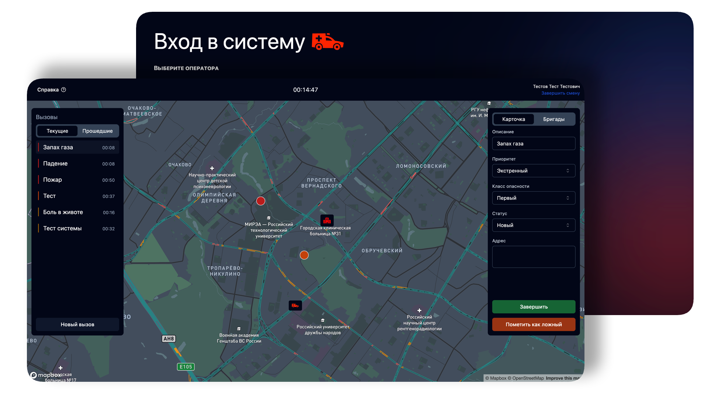

# Emergency Service Dashboard | Frontend
Панель оператора системы-112 | Фронтенд ([RU](./README.md))

---

**Emergency Service 112** is a unified service providing emergency assistance in critical situations. This service is available 24/7, free of charge from any phone, and often even without network signal. Calls are answered by an operator who determines the reason for the emergency and coordinates further assistance. The system operates in many CIS and European countries.

This repository contains the frontend of the rescue service operator's dashboard, created as a learning project. Currently, it includes the main screen with a call map, side panels with the call list, individual call cards, and an address search feature.



The backend is in a separate repository: [emergency_service_back](https://github.com/k0ndrateff/emergency_service_back).

## Features

- **List of incidents categorized into active and past calls**;
- **Call card with optimistic updates**;
- **Address search functionality**;
- **Visual representation of information on the map**.

## Tech Stack

- **Tooling**: [Vite](https://vite.dev/);
- **Routing**: [TanStack Router](https://tanstack.com/router/latest);
- **UI Components**: [Shadcn/ui](https://ui.shadcn.com/);
- **Maps**: [Mapbox](https://www.mapbox.com/);
- **Geocoding**: [DaData](https://dadata.ru/).

## Installation

1. Clone the repository:
   ```bash
   git clone https://github.com/k0ndrateff/emergency_service_front.git
   cd emergency_service_front
   ```

2. Install dependencies:
   ```bash
   npm install
   ```

3. Set environment variables:
    - Configure the backend connection;
    - Obtain a token from Mapbox and assign it to the `VITE_MAPBOX_TOKEN` variable.

4. Start the server:
   ```bash
   npm run dev
   ```

## Feedback and Suggestions

Feedback and suggestions are welcome in the `Issues` section!

## References and Resources

- Some ideas for designing the system were inspired by the existing 112 system: [Wikipedia](https://en.wikipedia.org/wiki/112_(emergency_telephone_number))

## Dura lex sed lex

The project was created for educational purposes only and is not intended for real use. All data is fictitious and has
no relation to reality.
